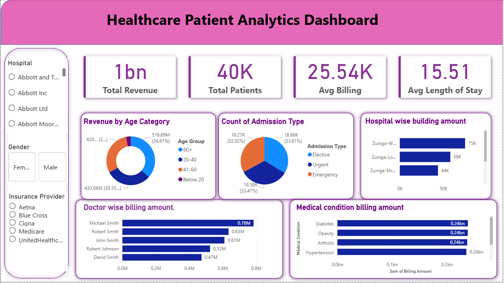

# Healthcare KPI Analysis

## Project Overview
This project analyzes healthcare data to identify key performance indicators (KPIs) such as revenue, patient count, billing amount, and length of stay. The goal is to transform raw healthcare data into meaningful insights using SQL and Power BI.

The dashboard helps hospitals monitor operational performance and make data-driven decisions.

---

## Dashboard Preview

## Tools & Technologies
- SQL
- Power BI
- Excel / CSV Dataset
- Data Cleaning
- Data Visualization

---

## Key Performance Indicators (KPIs)

- Total Revenue: **1 Billion**
- Total Patients: **40K**
- Average Billing Amount: **25.54K**
- Average Length of Stay: **15.51 days**

These KPIs provide a quick overview of hospital performance.

---

## Dashboard Analysis

### Revenue by Age Category
This chart shows revenue generated from different age groups:
- Below 20
- 20–40
- 41–60
- 60+

It helps identify which age group contributes most to hospital revenue.

---

### Admission Type Analysis
Patient admissions are categorized into:

- Elective
- Urgent
- Emergency

This analysis helps hospitals understand patient admission trends.

---

### Hospital-wise Billing Amount
This visualization shows hospitals generating the highest billing revenue.

---

### Doctor-wise Billing Amount
This chart highlights doctors contributing the most to hospital billing.

Example:
- Michael Smith
- Robert Smith
- John Smith

---

### Medical Condition Billing Analysis
This analysis identifies billing amounts for different medical conditions such as:

- Diabetes
- Obesity
- Arthritis
- Hypertension

---

## Dashboard Filters

The dashboard includes interactive filters:

- Hospital
- Gender
- Insurance Provider

These filters help users explore the data more effectively.

---

## Project Structure

Healthcare-KPI-Analysis
│
├── healthcare_dataset.csv
├── healthcare_analysis.sql
├── Healthcare_Dashboard.pbix
├── dashboard.png
└── README.md

---

## Business Insights
- Hospitals can identify high revenue medical conditions.
- Helps analyze patient demographics.
- Supports hospital performance monitoring.
- Enables better healthcare decision making.

---

## Author
**Sathish**
